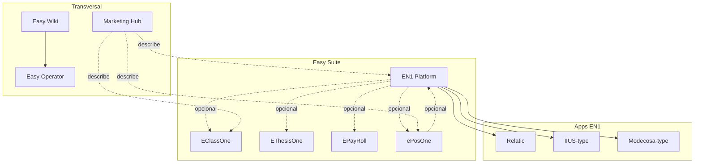

# Arquitectura funcional — Easy Suite

Documento maestro de **relaciones entre productos** Easy Technology Services.  
Responde *qué es cada pieza*, *cómo se conecta* y *en qué madurez está* — **sin** detalle de servidores, backups ni despliegue.

**Audiencia:** dirección, ventas, implementación, IA interna (Easy Operator).  
**Complementa:** [[02_Suite/easy_suite]] · [[02_Suite/mapa_suite]] · [[02_Suite/inventario_easy_suite]] *(dónde vive cada cosa en CODITO)*.

**Actualizado:** jun 2026.

---

## 1. Idea en una frase

**Easy Suite** es la familia comercial de EasyTech: **EN1 Platform** como núcleo modular SaaS multi-empresa, productos **satélite** que pueden operar solos o integrarse, y capas de **gobernanza** (wiki), **marketing** (mensajes) e **IA** (operador futuro).

---

## 2. Mapa oficial de la suite

```text
Easy Suite
│
├── EN1 Platform ........................ núcleo SaaS (Easy NodeOne)
│   │
│   ├── Apps / implementaciones EN1 .... instancias por cliente o entorno
│   │   ├── Relatic .................... producción · membresías Panamá
│   │   ├── IIUS-type .................. campus académico (referencia cliente)
│   │   ├── Modecosa-type .............. integración Odoo + catálogo
│   │   └── futuras apps EN1 ........... un silo = org + módulos + dominio
│   │
│   └── Módulos EN1 .................... activables por organización (tenant)
│       (pagos, taller, eventos, academic, sales, efactura, …)
│
├── Productos con código propio (fuera del monorepo EN1)
│   ├── EClassOne ...................... LMS / aula (Flask independiente hoy)
│   ├── EThesisOne ..................... tesis e investigación (Ethesis repo)
│   └── EPayRoll ....................... nómina (marca · sin producto aún)
│
├── ePosOne ............................ POS retail (marca · pilotos roadmap)
│
├── Capas transversales (no son “apps de negocio”)
│   ├── Marketing Hub .................. mensajes y campañas (solo wiki)
│   ├── Easy Wiki ...................... documentación viva EasyTech
│   └── Easy Operator ................ IA interna (planeado · Q3 2026)
│
└── Integraciones ...................... Odoo, ERP, APIs — ver [[03_Productos/integrations]]
```

---

## 3. ¿Qué es EN1?

**EN1 Platform** (marca comercial; código **Easy NodeOne**) es la **plataforma web modular** de EasyTech:

| Atributo | Definición |
|----------|------------|
| **Qué es** | Backend Flask + panel admin + portal miembros + checkout + módulos SaaS |
| **Para quién** | Negocios e instituciones que necesitan operación web integral |
| **Unidad de datos** | **Organización (tenant)** — logo, usuarios, módulos, pagos propios |
| **Unidad de despliegue** | **Silo** — copia del repo + `.env` + BD PostgreSQL + dominio |
| **Repo** | `github.com/shidalgo0925/Easy-NodeOne` |

EN1 **no es** un solo sitio: es **el motor** que puede alimentar muchas implementaciones (Relatic, prod genérico, dev, staging, clientes futuros).

Detalle funcional: [[03_Productos/en1_platform]] · técnico EN1: [[06_Arquitectura/arquitectura_en1]].

---

## 4. ¿Qué es una «App EN1»?

Una **App EN1** *(implementación EN1)* es una **instancia desplegada** del mismo producto base con identidad propia:

```text
App EN1 = Silo (código EN1) + Config (.env) + BD + Dominio + Módulos activos + Marca cliente
```

| Ejemplo | Silo | Dominio | Naturaleza |
|---------|------|---------|------------|
| **Relatic** | `/opt/easynodeone/relatic/` | `apps.relatic.org` | App EN1 **cliente producción** |
| **EN1 Prod EasyTech** | `/opt/easynodeone/prod/` | `appprd.easynodeone.com` | App EN1 **multi-cliente interno** |
| **EN1 Dev** | `/opt/easynodeone/dev/` | `appdev.easynodeone.com` | App EN1 **laboratorio** |
| **IIUS** *(referencia)* | otro host / silo | campus cliente | App EN1 **campus académico** |

**Regla:** Relatic **no es un producto distinto** de la suite — es una **App EN1** con contrato Relatic Panamá. Se documenta como cliente/implementación, no como cuarto producto junto a EN1.

Landings estáticos (`abril26.relatic.org`, `easynodeone.com`) **no son Apps EN1** — son marketing servido aparte; la lógica de negocio sigue en EN1.

---

## 5. Matriz de relación con EN1

| Producto / activo | ¿Depende de EN1? | Tipo | Notas |
|-------------------|------------------|------|-------|
| **Relatic** | ✅ Sí — *es* EN1 | App EN1 | Módulos: memberships, payments, … |
| **IIUS-type campus** | ✅ Sí | App EN1 | Módulo `academic`, campus cerrado |
| **Modecosa-type** | ✅ Sí + Odoo | App EN1 + integración | Catálogo seguridad vía Odoo |
| **EClassOne** | ⚠️ **Parcial / evolutivo** | Producto **propio** hoy | Marca educativa; puede **convivir** con EN1 (IIUS) o desplegarse **solo** (CODITO) |
| **EThesisOne** | ⚠️ **Opcional** | Producto **propio** | Repo `Ethesis`; usuarios pueden alinearse a EN1 por proyecto |
| **EPayRoll** | ⚠️ **Opcional** | Producto **futuro** | Contactos/empleados desde EN1 si se integra |
| **ePosOne** | ⚠️ **Opcional** | Producto **satélite** | POS standalone o EN1 back-office |
| **Marketing Hub** | ❌ No | Documentación | Describe productos; no runtime |
| **Easy Wiki** | ❌ No | Gobernanza | Fuente de verdad documental |
| **Easy Operator** | ❌ No *(lee EN1 vía docs/repos)* | IA planificada | Consumidor de wiki + Git |
| **Integraciones Odoo** | Puente | Capacidad EN1 | No producto de suite |

---

## 6. ¿SaaS independientes vs productos terminados?

### 6.1 Clasificación por modelo

| Clase | Productos | Significado |
|-------|-----------|-------------|
| **Plataforma SaaS** | EN1 Platform | Multi-tenant por organización; módulos on/off |
| **SaaS / app independiente** | EClassOne, EThesisOne *(desplegados)* | Repo y runtime **propios**; no comparten BD con EN1 salvo integración acordada |
| **Producto satélite** | ePosOne, EPayRoll | Marca suite; código o piloto **pendiente / roadmap** |
| **Implementación cliente** | Relatic, IIUS, Modecosa | **Apps EN1** o proyectos en `05_Proyectos/` |
| **No-SaaS (documentación)** | Marketing Hub, Easy Wiki | Sin aplicación de negocio |
| **IA interna** | Easy Operator | Herramienta equipo; no vendible como suite |

### 6.2 Clasificación por madurez *(jun 2026)*

| Estado | Productos | Criterio |
|--------|-----------|----------|
| **Producción** | EN1 (apps Relatic + prod), Relatic landing | Clientes en vivo, SLA contractual |
| **Staging / preprod** | EN1 staging, EClassOne staging | Validación antes de prod |
| **Laboratorio** | EN1 dev, EThesisOne en CODITO, stack IA, Easy Wiki | Experimentación; no contrato cliente principal |
| **MVP / piloto** | ePosOne *(roadmap Q3)*, EPayRoll *(Q4 visión)* | Ficha comercial; sin deploy estándar |
| **Planeado** | Easy Operator | Solo visión en [[08_IA/easy_operator]] |
| **Marca sin producto** | EPayRoll *(hoy)* | Placeholder wiki |

Inventario despliegue real: [[02_Suite/inventario_easy_suite]].

---

## 7. Producto por producto

### EN1 Platform

- **Qué resuelve:** operación web integral (miembros, pagos, ERP ligero, educación, taller, eventos…).
- **Madurez:** **Producto terminado** en evolución continua; núcleo de la empresa.
- **Roadmap:** [[10_Roadmap/roadmap_2026]] — ERP, pagos, taller, FE Panamá.

### Relatic *(App EN1)*

- **Qué resuelve:** membresías, pagos PayPal, portal miembros Relatic Panamá.
- **Madurez:** **Producción**.
- **Wiki gap:** falta `04_Clientes/relatic.md`.

### EClassOne

- **Qué resuelve:** aula digital, experiencia campus (marca educativa).
- **Relación EN1:** en propuesta comercial suele **venderse con EN1** (IIUS); técnicamente **app separada** en CODITO.
- **Madurez:** **Laboratorio → prod** según silo (dev/staging/prod en host compartido).

### EThesisOne

- **Qué resuelve:** flujos de tesis, revisión, trazabilidad académica.
- **Relación EN1:** puede **compartir identidad**; no requiere EN1 para existir.
- **Madurez:** **Laboratorio** (demo operativa en CODITO).

### EPayRoll

- **Qué resuelve:** nómina (visión).
- **Madurez:** **MVP comercial pendiente** — solo documentación.
- **Roadmap:** Q4 2026 según demanda.

### ePosOne

- **Qué resuelve:** caja y mostrador retail.
- **Madurez:** **MVP / roadmap Q3 2026**.
- **Relación EN1:** opcional (inventario, contactos).

### Marketing Hub

- **Qué es:** **centro de mensajes** — elevator pitches, audiencias, campañas.
- **No es** aplicación desplegada.
- **Madurez:** **Documentación viva** — [[09_Marketing/marketing_hub]].

### Easy Wiki

- **Qué es:** wiki operativa EasyTech (Obsidian + Git).
- **Madurez:** **MVP en curso** (Fase 2 auditoría completada).
- **Roadmap:** publicación estática Q4 2026.

### Easy Operator

- **Qué es:** asistente IA interno (wiki + repos + estado proyectos).
- **Madurez:** **Planeado** — [[08_IA/easy_operator]].
- **Roadmap:** Q3 2026 prototipo.

---

## 8. Diagrama de dependencias (funcional)



---

## 9. Roadmap oficial (referencia)

Fuente única de prioridades: [[10_Roadmap/roadmap_2026]].

| Horizonte | Foco suite |
|-----------|------------|
| **Q1–Q2 2026** | EN1 ERP operativo; Easy Wiki MVP; IIUS campus; Modecosa Odoo |
| **Q3 2026** | ePosOne pilotos; Easy Wiki fase 2; Easy Operator prototipo |
| **Q4 2026** | EPayRoll / EThesisOne según demanda; publicación wiki |
| **2027** | [[10_Roadmap/roadmap_2027]] — expansión satélites |

Backlog no comprometido: [[10_Roadmap/backlog]].

---

## 10. Cómo usar este documento

| Pregunta | Ir a |
|----------|------|
| ¿Qué vendemos? | [[02_Suite/mapa_suite]] · [[09_Marketing/marketing_hub]] |
| ¿Qué módulos tiene EN1? | [[03_Productos/en1_platform]] |
| ¿Dónde está desplegado X? | [[02_Suite/inventario_easy_suite]] |
| ¿Cómo se despliega EN1? | [[07_Operaciones/deploy]] |
| ¿Arquitectura técnica EN1? | [[06_Arquitectura/arquitectura_en1]] |
| ¿Servidor Relatic? | [[06_Arquitectura/servidores/CODITO]] *(infra — otra capa)* |

---

## 11. Glosario rápido

| Término | Significado |
|---------|-------------|
| **Easy Suite** | Marca paraguas de productos EasyTech |
| **EN1 / Easy NodeOne** | Plataforma modular central |
| **App EN1** | Instancia EN1 (silo + cliente + dominio) |
| **Tenant / organización** | Cliente lógico dentro de una App EN1 |
| **Módulo EN1** | Feature flag por organización (`workshop`, `academic`, …) |
| **Silo** | Despliegue físico (dev, prod, relatic, …) |
| **Producto satélite** | Marca suite con ciclo propio (ePosOne, EPayRoll) |
| **Marketing Hub** | Documentación comercial, no app |

---

**Empresa:** [[01_Empresa/easytechnology]] · **Gobierno:** [[00_Gobierno/gobierno_tecnologico]] · **Suite:** [[02_Suite/easy_suite]]
